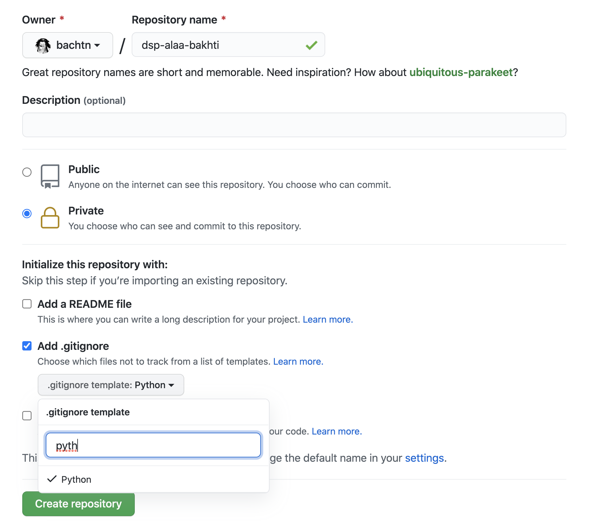

summary: PW0 - Practical work 0
id: pw0
categories: git, environment management
tags: git, environment management
status: Published
authors: Alaa BAKHTI
Feedback Link: https://github.com/EPITA-courses/dsp_practical_work/issues/new

# Data Science in production practical work 0

In this practical work, we will be going over 2 concepts that are important for Data Scientists:
*Code versioning with `Git`* and *environment management in `Python`*

## Code versioning with *Git*

In this course, we will be using [*Git*](https://git-scm.com/) for code versioning: practical work
and project code submission will be done in [*GitHub*](https://github.com/). Mastering this technology is not only
essential for this course but it is also a must have skill in the IT domain today.

This practical work will be as follows
- Install and configure `Git`
- Create and setup a `GitHub` account (SSH key, etc)
- Create a `GitHub` repository and clone it locally
- Go over `Git` concepts and apply them

### *Git* installation and *GitHub* account setup 

1. [Install *Git* on your OS](https://github.com/git-guides/install-git)

2. Setup your `Git` username and email address. These information will be associated to your `Git` commits
   1. Open `Terminal` (or `Git Bash` for Windows users)
   2. Set a `Git` username
   ```shell
   $ git config --global user.name "Mona Lisa"
   ```
   3. Confirm that you have set the Git username correctly
   ```shell
   $ git config --global user.name
   > Mona Lisa
   ```
   4. Set a `Git` email address
   ```shell
   $ git config --global user.email "email@example.com"
   ```
   5. Confirm that you have set the email address correctly in Git
   ```shell
   $ git config --global user.email
   > email@example.com
   ```
   
     - For more information: [Git setup](https://git-scm.com/book/en/v2/Getting-Started-First-Time-Git-Setup),
     [username setup](https://docs.github.com/en/get-started/getting-started-with-git/setting-your-username-in-git),
     [email address setup](https://docs.github.com/en/account-and-profile/setting-up-and-managing-your-github-user-account/managing-email-preferences/setting-your-commit-email-address#setting-your-commit-email-address-in-git)
   


3. Create a [GitHub](https://github.com/) account 

4. Configure your SSH key in your `GitHub` account
    
    When working with a `GitHub` repository, you'll often need to identify yourself to `GitHub` using your username and password.
    An SSH key is an alternate way to identify yourself that doesn't require you to enter you username and password every time.
    
    SSH keys come in pairs, a public key that gets shared with services like `GitHub`, and a private key that is stored 
    only on your computer. If the keys match, you're granted access.

    1. [Check if you have an existing SSH key in your computer](https://docs.github.com/en/authentication/connecting-to-github-with-ssh/checking-for-existing-ssh-keys)
    2. [Generate a new SSH key](https://docs.github.com/en/authentication/connecting-to-github-with-ssh/generating-a-new-ssh-key-and-adding-it-to-the-ssh-agent)
    3. [Add the generated SSH key to your GitHub account](https://docs.github.com/en/authentication/connecting-to-github-with-ssh/adding-a-new-ssh-key-to-your-github-account)
    

### Create a *GitHub* repository

1. Sign in to your `GitHub` repository
2. Create a `GitHub` repository named `dsp-firstname-lastname` (eg: `dsp-alaa-bakhti`) and set it up as follows:
    - Make it private
    - Add the `python` template for `.gitignore` as shown in the image below.
    More information on the gitignore file [here](https://git-scm.com/docs/gitignore).


3. To be able to access your repository, you need to add me as a collaborator:
   - Click on `settings > manage access > invite a collaborator` (more information [here](https://docs.github.com/en/account-and-profile/setting-up-and-managing-your-github-user-account/managing-access-to-your-personal-repositories/inviting-collaborators-to-a-personal-repository)).
   - Add my username `bachtn`
   (with [Kenpachi Zaraki](https://bleach.fandom.com/fr/wiki/Kenpachi_Zaraki?file=C5EC4897-5D25-4C50-B4E2-8C8BCAA09FD0.jpeg)
   picture).
4. [Clone the repository locally using the **SSH** URL](https://docs.github.com/en/repositories/creating-and-managing-repositories/cloning-a-repository)

    Make sure to use the URL with `SSH` (*git@github.com:YOUR-USERNAME/YOUR-REPOSITORY*) and not with `https` 
    (*https://github.com/YOUR-USERNAME/YOUR-REPOSITORY*)


Congratulation, your environment is setup and ready for the course practical work :grinning:	


### Useful links
- [Documentation for the different Git commands](https://git-scm.com/docs)
- [Learn Git Branching](https://learngitbranching.js.org/)
- [Visualizing Git Concepts with D3](https://onlywei.github.io/explain-git-with-d3/)
- [Adding locally hosted code to GitHub](https://docs.github.com/en/get-started/importing-your-projects-to-github/importing-source-code-to-github/adding-locally-hosted-code-to-github)
- [GIT PURR! Git Commands Explained with Cats!](https://girliemac.com/blog/2017/12/26/git-purr/)
- [Pro Git book](https://git-scm.com/book/en/v2)


## Environment management in Python
**TODO**
