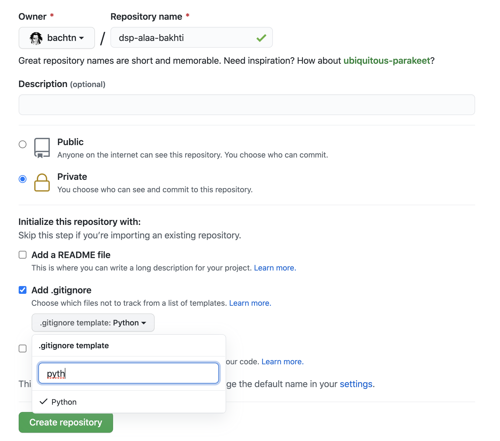
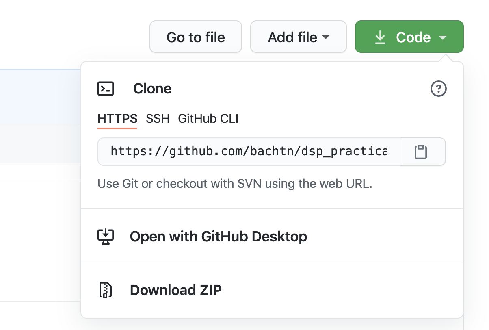

summary: PW1 - Practical work 1
id: pw1
categories: modeling
tags: modeling
status: Published
authors: Alaa BAKHTI
Feedback Link: https://github.com/EPITA-courses/dsp_practical_work/issues/new

# Data Science in production practical work 1

## Software setup
### Git
In this course, we will be using [Git](https://git-scm.com/) for the practical work code versioning and the assignment's
submission. If you don't have `Git` in your computer, you need to install it: 
- If you are a `linux` or a `macos` user, execute the following command in your terminal
    ```shell
    # for linux
    $ sudo apt install git-all
    
    # for macos
    $ brew install git
    ```
- If you are using windows, you need to install the [Git bash application](https://gitforwindows.org/).

If you encounter any problem during the installation, the official documentation
[tutorial](https://git-scm.com/book/en/v2/Getting-Started-Installing-Git) may help you. 

### Kaggle API
We will be using the `kaggle` API to download datasets and to make submissions for the competitions.
To set it up, you need to:

1. Install the `kaggle` package ([doc](https://www.kaggle.com/docs/api#installation))
    ```shell
    $ pip install kaggle --upgrade
    ```

2. Setup the API credentials by following [the official tutorial](https://www.kaggle.com/docs/api#authentication)

3. Test if the API is working
    ```shell
    $ kaggle kernels list -s titanic
    ```

You can access the API documentation [here](https://www.kaggle.com/docs/api).

## Setup a github repository
Now that you have `Git` installed, you'll create the `github` repository that you'll be using for this course
practical work and assignments.

1. Sign in to your [github](https://github.com/) account or create it if you don't already have one.

2. Create a github repository named `dsp-firstname-lastname` (eg: `dsp-alaa-bakhti`) and set it up as follows:
    - Make it private
    - Add the `python` template for `.gitignore` as shown in the image below.
    More information on the gitignore file [here](https://git-scm.com/docs/gitignore).



3. To be able to access your repository, you need to add me as a collaborator:
   - Click on `settings > manage access > invite a collaborator`.
   - Add my username `bachtn`
   (with [Kenpachi Zaraki](https://bleach.fandom.com/fr/wiki/Kenpachi_Zaraki?file=C5EC4897-5D25-4C50-B4E2-8C8BCAA09FD0.jpeg)
   picture).

4. Clone the repository locally
    - If you already have your ssh keys setup, copy the repository `ssh` url otherwise copy the `https` one
      (you will need to use your github account credentials to clone the repository in this case).
      Note: If you want to setup your ssh key, you can follow this [tutorial](
   https://docs.github.com/en/github/authenticating-to-github/connecting-to-github-with-ssh/adding-a-new-ssh-key-to-your-github-account)
    
    
    - Open your terminal, navigate to the folder where you want to clone the repository and clone it using the url
    you've just copied
    ```shell
    $ cd my/favorite/folder/path
    $ git clone https://github.com/bachtn/dsp_alaa_bakhti.git
    ```

5. For each practical work, you will be working on a separate Git branch named `pwindex` where `index` refers
to the practical work number (`pw1` for this one).
    ```shell
    # Navigate to the folder you've just cloned
    $ cd dsp_alaa_bakhti
    
    # Create a new branch named `pw1`
    $ git branch pw1
    
    # Checkout to the newly created branch
    $ git checkout pw1
    ```

6. In the root of the repository folder, create two folders: `data` and `notebooks`:
    - `data` for storing the different datasets
    - `notebooks` for storing the different notebook
    
    ```shell
    $ mkdir data notebooks
    ```

Congrats, you've just completed the setup of your github repository. Now let's start working on the serious stuff :) .

## Modeling

### Use case
We will be working on the [kaggle House Prices use case](https://www.kaggle.com/c/house-prices-advanced-regression-techniques/overview)
in some of the practical works of this course where the goal is to predict the price of houses using both continuous and
categorical features. Let's start by setting up the dataset folder:

1. Download the dataset using the kaggle API
    ```shell
    $ kaggle competitions download -c house-prices-advanced-regression-techniques
    ```

    If you didn't setup the API yet, you can download the dataset directly from the
    [competition webpage](https://www.kaggle.com/c/house-prices-advanced-regression-techniques/data)
    by clicking on the `Data` tab and then the `Download All` button in the bottom left.


2. Move the dataset to the `house-prices` folder and unzip it
    ```shell
    # Create the house-prices folder
    $ mkdir data/house-prices
    
    # Move the dataset
    $ mv house-prices-advanced-regression-techniques.zip data/house-prices
    
    # Navigate to the house-prices folder
    $ cd data/house-prices
    
    # Unzip the dataset
    $ unzip -o house-prices-advanced-regression-techniques.zip -d .
    ```

### Baseline model 

When working on a data science use case, some pattern we may observe is that some students will spend too much time
working on the pre-processing and feature engineering steps before implementing and evaluating a 1st model.
The problem with this is that they will not have any feedback on the effect of their work on the model:
is it improving it or not?

One of the best practices of data science is to always start by implementing a first simple baseline model
before focusing on the model improvement. This baseline model can be used to:
- put in place the whole modeling pipeline (load, process, train, evaluate) so that the data scientist will be able
  to get feedback on the different modeling steps that he / she is exploring (pre-processing, feature engineering, etc).
  With this pipeline is place, he / she will be able to answer the following questions:
  - Does this new missing values imputation strategy improves the model performance or not?
  - Does dropping the feature `house_age` improves the model performance?
- This baseline model may also be used to establish a 1st baseline model performance that the data scientist can use to
  compare the new models against.

To create this baseline model you will start by creating a 1st simple pipeline with a dummy model before starting
to implement a more advanced model

#### 1st pipeline
- Your goal here is to implement a simple modeling pipeline that will be composed of:
1. Data setup (reading, split to train and test sets)
2. The minimum preprocessing and / or feature engineering required to prepare the data for the model (eg: remove missing values)
3. Training a model
4. Evaluating it with the competition metric `Root-Mean-Squared-Error (RMSE) between the logarithm of the predicted value
  and the logarithm of the observed sales price`
5. Making a submission to the `kaggle` competition


- To evaluate the model, you can use the following function
    ```python
    import numpy as np
    from sklearn.metrics import mean_squared_log_error
    
    def compute_rmsle(y_test: np.ndarray, y_pred: np.ndarray, precision: int = 2) -> float:
        rmsle = np.sqrt(mean_squared_log_error(y_test, y_pred))
        return round(rmsle, precision)
    ```

- To make a submission to the competition, you need to:
    1. Use your model to predict the house prices of the data in the `test.csv` file.
    2. Create a submission file in the same format as the `sample_submission.csv` file. Check the `Submission File Format`
       [section](https://www.kaggle.com/c/house-prices-advanced-regression-techniques/overview/evaluation) for more information. 
    3. Make submission with the `Kaggle` API
        ```shell
        $ kaggle competitions submit -c house-prices-advanced-regression-techniques -f /path/to/submission/file.csv -m dummy-model
        ```
    4. Get the submission score with the API
       ```shell
        # List the different submissions you've made to the competition
        $ kaggle competitions submissions -c house-prices-advanced-regression-techniques
        ```
   
**TODO**
- [ ] Create the pipeline with a dummy model
- [ ] Log the score of this first model (dummy model) on the competition test set. You'll need to submit it in the assignment along with other
  scores that you'll computing.

#### Baseline model
Now that you've put in place a first simple pipeline with a dummy model, you will start by improving it to create your
baseline model. For that, you need to only use simple approaches. For example,
train the model with the n features that are very correlated with the target.  

**TODO**
- [ ] Implement the baseline model.
- [ ] Log its score on the competition test set.

### Model improvement
After creating your baseline model, you need to iterate on it andd dto improve it by using
**both continuous and categorical features**:
- Improve your pre-processing
- Do some feature engineering
- Test other models

After creating this model, compare it to your baseline.

**TODO**
- [ ] Implement the model using **both continuous and categorical features**.
- [ ] Log its score on the competition test set.

## Assignment submission instructions
In this assignment, you need to do the different **TODO** sections of this document (3 in total).
All the models should be included in the same notebook. Threfore you need to create 3 separate parts: Dummy model,
Baseline model and Continuous & categorical variables model 

When making the submission, you need to:
- Log the different model performances in **the first cell of your notebook**
- Submit **the link to the notebook where you created the different models** in the submission form.
  You should not submit the notebook itself !
- Make sure that you respect the following rules in your notebook
    - Your notebook should be organised with headers (dataset loading, preprocessing, etc)
    - Use comments if needed
    - Do not remove the cell outputs (my grading will be based on that)
    - When displaying the dataframe content, do not display more than 20 rows, use head, sample, tail methods if needed.
